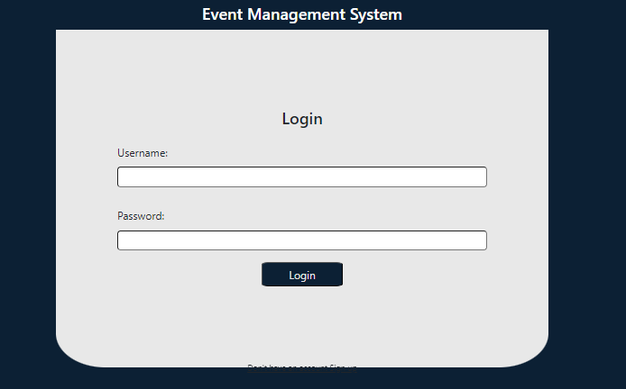
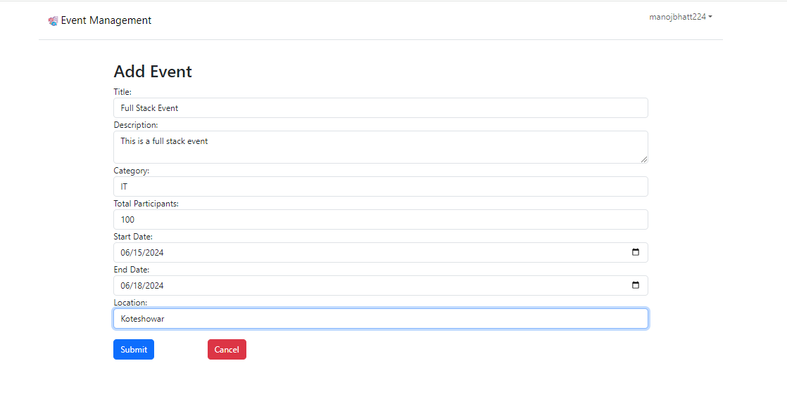

# Event Management System

It allows organizers/users to perform CRUD operations on events with authenticated set of users. Instead of using a database, the application stores data in a JSON file.


## Features
- CRUD Operations: Users can create, read, update, and delete events.
- Validation: Both client-side and server-side validation are implemented to ensure data integrity.
- Filtering: Users can filter events by title, start date, and end date.
- Only authenticated users can perform CRUD operations.

## Setup Instructions
The repository contains direct entry to backend environment and front end client server is located in client_react directory.

1. Clone the repository

```bash
git clone https://manojbhatt224-admin@bitbucket.org/manojbhatt224/event_management.git
```
2. Navigate to project directory and install packages/dependencies

```bash
cd event_management
npm install
``` 
3. Start the server
```bash
npm run start
```
4. Open a new terminal tab, navigate to the client directory and install dependencies:
```bash
cd client_react
npm install 
```
5. Start the client
```bash
npm start
```
6. Access the application in your browser at http://localhost:3000.
Note: (open users.json file in see any login credentials. Focus on login authentication and other crud operation is done. Backend api for signup but not in front end.)

## Screenshots
### Login Page


### Invalid Login


### Dashboard


### Session Expire


### Add Event


### Invalid Add Event


### Edit Event


### Invalid Edit Event


### Delete Event


### Filter Event


### Event Not Found

